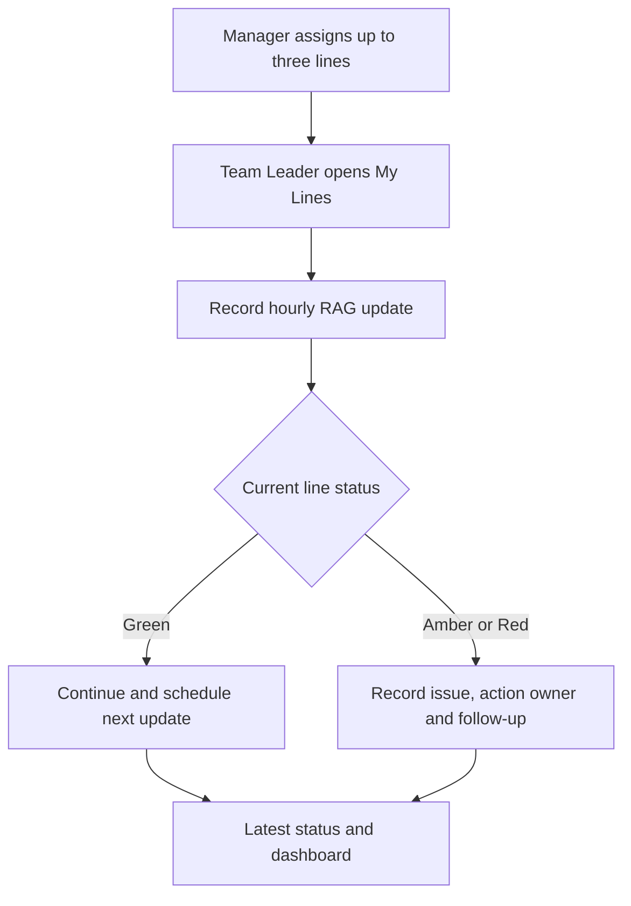
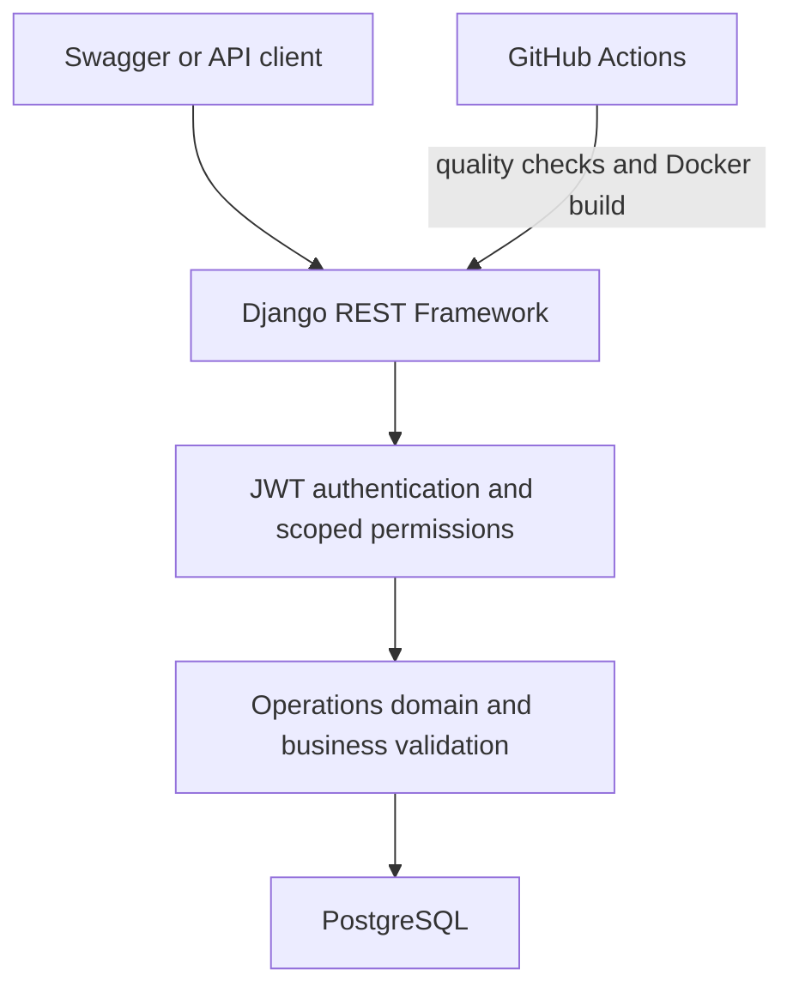
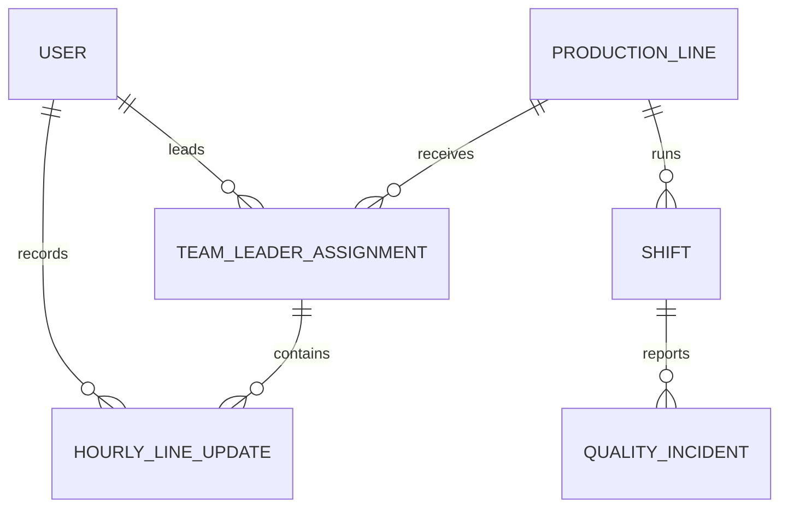

# Production Operations API

[](https://github.com/MasumTech/production-ops-api/actions/workflows/ci.yml)
[](https://www.python.org/)
[](https://www.djangoproject.com/)
[](https://www.docker.com/)
[](LICENSE)

A production-focused REST API for managing manufacturing lines, shifts, production performance, downtime, and quality incidents.

The project demonstrates a structured Django backend using JWT authentication, PostgreSQL, Docker, automated testing, and continuous integration.

**Portfolio scope:** Backend API engineering focused on production workflows, data integrity, access control, automated quality gates, and containerized delivery.

[Business problem](#the-real-world-problem) · [Workflow](#operational-workflow) · [Architecture](#system-architecture) · [Data model](#core-data-model) · [API](#api-endpoints) · [Run locally](#quick-start-with-docker)

## The Real-World Problem

On a busy manufacturing shift, one Team Leader may be responsible for up to three production lines at the same time. When one line slows down or stops because of a material blockage, equipment fault, quality concern, or staffing issue, verbal updates and paper notes quickly become incomplete or outdated.

The API addresses five operational control gaps:

- unclear ownership when one Team Leader covers several lines
- no consistent way to show the current Green, Amber, or Red condition
- delayed escalation when an issue needs engineering or management support
- missing action owners, next-update deadlines, and follow-up evidence
- time lost asking several people for the latest position during the shift

## Representative Shift Scenario

| Moment | Operational risk | System response |
|---|---|---|
| Shift start | One Team Leader is covering Lines 01, 02, and 03 | Management creates dated, shift-specific line assignments |
| Line 02 slows or blocks | The issue may be shared verbally but not recorded consistently | The Team Leader submits an Amber or Red update with the issue summary |
| Support is requested | Nobody is clearly responsible for the action or deadline | The update records the action, owner, support required, and next-update time |
| Management reviews the floor | Staff must call each line to discover the current position | `latest-status` returns one current update for every accessible assignment |
| Shift follow-up | Previous decisions and escalation history may be lost | Timestamped records preserve who reported the issue and what happened next |

## Operational Workflow



## Business Outcomes

- Clear responsibility across several production lines during the same shift
- Faster visibility of stopped, at-risk, and stable lines
- Consistent escalation with named owners and next-update deadlines
- Less reliance on radio calls, paper notes, and fragmented spreadsheets
- An auditable operational history for management and shift handovers
- Scoped visibility: Team Leaders see their own lines while staff retain oversight

## System Architecture



## Core Data Model



## Engineering Highlights

- Relational domain modelling with database constraints and targeted indexes
- Assignment-scoped access control for Team Leaders and management staff
- Business validation for incident resolution, line status, and follow-up deadlines
- Efficient related-object loading and aggregate dashboard queries
- Versioned migrations, interactive OpenAPI documentation, and JWT authentication
- Automated formatting, linting, system checks, tests, Compose validation, and Docker builds
- Non-root Gunicorn container with application and PostgreSQL health checks

## Key Capabilities

| Area | Capability | Operational value |
|---|---|---|
| Line ownership | Date- and shift-specific Team Leader assignments | Makes multi-line responsibility explicit |
| Hourly control | Green, Amber, and Red updates with issues and deadlines | Shows the current condition and required response |
| Production performance | Planned output, actual output, downtime, and performance percentage | Turns shift activity into measurable KPIs |
| Quality management | Incident severity, status, root cause, and corrective action | Supports structured investigation and closure |
| Management visibility | Dashboard summary, latest status, search, filtering, and ordering | Reduces manual status chasing |
| Platform controls | JWT, scoped permissions, validation, pagination, health checks, and OpenAPI | Provides a secure and maintainable API foundation |

## Technology Stack

| Area | Technology |
|---|---|
| Language | Python 3.12 |
| Framework | Django 5.2 |
| API | Django REST Framework |
| Authentication | Simple JWT |
| Database | PostgreSQL 16 |
| API documentation | drf-spectacular / Swagger UI |
| Application server | Gunicorn |
| Containers | Docker and Docker Compose |
| Testing | pytest and pytest-django |
| Code quality | Ruff |
| Continuous integration | GitHub Actions |

## Core Models

### HourlyLineUpdate

Records an operational status update for an assigned production line:

- Green, Amber, or Red line status
- Current product and issue summary
- Action taken and responsible action owner
- Support requirements and follow-up indicator
- Recorded time and next update deadline
- User who recorded the update

### TeamLeaderAssignment

Records Team Leader responsibility for a production line, date, and shift:

- Team Leader and production line
- Assignment date and shift type
- Management user who created the assignment
- Optional assignment notes
- Prevention of duplicate line assignments for the same shift

### ProductionLine

Stores production line details, including:

- Unique line code
- Name and location
- Target units per hour
- Operational status

### Shift

Records production activity for a particular line and date, including:

- Day or night shift
- Supervisor
- Planned and actual output
- Downtime
- Automatically calculated performance percentage

A production line cannot have duplicate shifts with the same date and shift type.

### QualityIncident

Tracks production quality issues, including:

- Category and severity
- Incident status
- Description and immediate action
- Root cause and corrective action
- Occurrence and resolution time
- User who reported the incident

## API Endpoints

| Method | Endpoint | Description |
|---|---|---|
| `POST` | `/api/auth/token/` | Obtain JWT access and refresh tokens |
| `POST` | `/api/auth/token/refresh/` | Refresh an access token |
| `GET` | `/api/schema/` | Download the OpenAPI schema |
| `GET` | `/api/docs/` | Open Swagger API documentation |
| `GET, POST` | `/api/production-lines/` | List or create production lines |
| `GET, PUT, PATCH, DELETE` | `/api/production-lines/{id}/` | Manage one production line |
| `GET, POST` | `/api/shifts/` | List or create shifts |
| `GET, PUT, PATCH, DELETE` | `/api/shifts/{id}/` | Manage one shift |
| `GET, POST` | `/api/quality-incidents/` | List or create quality incidents |
| `GET, PUT, PATCH, DELETE` | `/api/quality-incidents/{id}/` | Manage one quality incident |
| `GET` | `/api/health/` | Check application and database health |
| `GET, POST` | `/api/team-leader-assignments/` | List or create line assignments |
| `GET, PUT, PATCH, DELETE` | `/api/team-leader-assignments/{id}/` | Manage one line assignment |
| `GET` | `/api/team-leader-assignments/my-lines/` | List the current user’s assigned lines |
| `GET, POST` | `/api/hourly-line-updates/` | List or create hourly line updates |
| `GET, PUT, PATCH, DELETE` | `/api/hourly-line-updates/{id}/` | Manage one accessible hourly update |
| `GET` | `/api/hourly-line-updates/latest-status/` | Return the latest update for every accessible assignment |

All operations endpoints require a JWT access token:

```http
Authorization: Bearer <access-token>
```

## Example Hourly Status Response

```json
{
  "id": 42,
  "assignment": 7,
  "production_line_code": "LINE-01",
  "production_line_name": "Primary Packing Line",
  "team_leader_username": "team.leader",
  "status": "amber",
  "current_product": "Demo Product A",
  "issue_summary": "Output is below the hourly target.",
  "action_taken": "Engineering support requested.",
  "requires_follow_up": true,
  "recorded_by_username": "team.leader",
  "next_update_due_at": "2026-08-26T15:30:00Z"
}
```

## Pagination

List endpoints return a maximum of 20 records per page.

```json
{
  "count": 21,
  "next": "http://localhost:8000/api/production-lines/?page=2",
  "previous": null,
  "results": []
}
```

Request another page using the `page` query parameter:

```text
/api/production-lines/?page=2
/api/shifts/?page=2
/api/quality-incidents/?page=2
```

Pagination can be combined with filtering, search, and ordering:

```text
/api/production-lines/?status=active&page=2
/api/shifts/?ordering=-actual_output&page=2
```

## Search, Filtering, and Ordering

Examples:

```text
/api/production-lines/?status=active
/api/production-lines/?search=packing
/api/shifts/?production_line=1
/api/shifts/?shift_type=day
/api/shifts/?date=2026-08-21
/api/quality-incidents/?severity=high
/api/quality-incidents/?status=open
/api/quality-incidents/?category=packaging
/api/shifts/?ordering=-actual_output
/api/hourly-line-updates/?date=2026-08-26
/api/hourly-line-updates/?shift_type=day
/api/hourly-line-updates/?production_line=1
/api/hourly-line-updates/?status=red
/api/hourly-line-updates/?requires_follow_up=true
/api/hourly-line-updates/latest-status/?status=amber
/api/team-leader-assignments/?date=2026-08-26
/api/team-leader-assignments/?shift_type=day
/api/team-leader-assignments/?production_line=1
/api/team-leader-assignments/my-lines/?date=2026-08-26&shift_type=day
```

## Dashboard Date Filtering

The operations dashboard can summarize all available records or filter the results by date.

```text
/api/dashboard/summary/
/api/dashboard/summary/?date_from=2026-08-01
/api/dashboard/summary/?date_to=2026-08-31
/api/dashboard/summary/?date_from=2026-08-01&date_to=2026-08-31
```

`date_from` and `date_to` must use the `YYYY-MM-DD` format.

The API returns `400 Bad Request` when `date_from` is later than `date_to`.

## Team Leader Assignment Permissions

- Management staff can list, create, update, and delete assignments.
- Regular authenticated users can only view their own assignments.
- The `my-lines` endpoint always returns assignments belonging to the current user.
- Inactive users and inactive production lines cannot receive new assignments.

## Hourly Line Update Permissions

- Management staff can access updates for all line assignments.
- Team Leaders can only access and record updates for their assigned lines.
- The authenticated user is automatically recorded as the update author.
- Amber and Red updates require an issue summary.
- Red updates must be marked for follow-up.
- Inactive users cannot be selected as action owners.

## Quick Start with Docker

### Prerequisites

- Docker Desktop
- Docker Compose
- Git

### 1. Clone the repository

```bash
git clone git@github.com:MasumTech/production-ops-api.git
cd production-ops-api
```

### 2. Create the Docker environment file

```bash
cp .env.docker.example .env.docker
```

Update the placeholder secrets inside `.env.docker` before using the application outside local development.

### 3. Start the application

```bash
docker compose up --build -d
```

### 4. Apply database migrations

```bash
docker compose exec web python manage.py migrate
```

### 5. Create an administrator

```bash
docker compose exec web python manage.py createsuperuser
```

The application will be available at:

| Service | URL |
|---|---|
| Swagger documentation | http://localhost:8000/api/docs/ |
| Django admin | http://localhost:8000/admin/ |
| OpenAPI schema | http://localhost:8000/api/schema/ |

Check the running containers:

```bash
docker compose ps
```

View application logs:

```bash
docker compose logs --tail=50 web
```

Stop the containers:

```bash
docker compose down
```

The PostgreSQL data remains stored in the named Docker volume after the containers stop.

## Local Development

### 1. Create and activate a virtual environment

```bash
python3 -m venv .venv
source .venv/bin/activate
```

### 2. Install dependencies

```bash
python -m pip install --upgrade pip
python -m pip install -r requirements.txt
```

### 3. Create the local environment file

```bash
cp .env.example .env
```

The default local configuration uses SQLite, so PostgreSQL is not required for this setup.

### 4. Apply migrations and start Django

```bash
python manage.py migrate
python manage.py createsuperuser
python manage.py runserver
```

## Authentication Example

Request JWT tokens:

```bash
curl -X POST http://localhost:8000/api/auth/token/ \
  -H "Content-Type: application/json" \
  -d '{"username":"your-username","password":"your-password"}'
```

Use the returned access token:

```bash
curl http://localhost:8000/api/production-lines/ \
  -H "Authorization: Bearer <access-token>"
```

## Testing and Code Quality

Run the complete test suite:

```bash
python -m pytest
```

Check Django configuration:

```bash
python manage.py check
```

Check code formatting:

```bash
python -m ruff format --check .
```

Run lint checks:

```bash
python -m ruff check .
```

Check whitespace errors:

```bash
git diff --check
```

## Continuous Integration

GitHub Actions automatically runs the following checks for changes targeting `main`:

1. Dependency installation
2. Ruff formatting check
3. Ruff lint check
4. Django system check
5. pytest test suite
6. Docker Compose configuration validation
7. Docker image build

## Project Structure

```text
production-ops-api/
├── .github/workflows/   # GitHub Actions configuration
├── config/              # Django settings and root URLs
├── operations/          # Models, serializers, views, URLs, and tests
├── Dockerfile           # Django application image
├── LICENSE              # MIT open-source license
├── compose.yml          # Web and PostgreSQL services
├── manage.py            # Django management command
├── pytest.ini           # pytest configuration
├── requirements.txt     # Python dependencies
└── ruff.toml            # Ruff configuration
```

## Author

**Md Masum Reza**

- GitHub: [MasumTech](https://github.com/MasumTech)