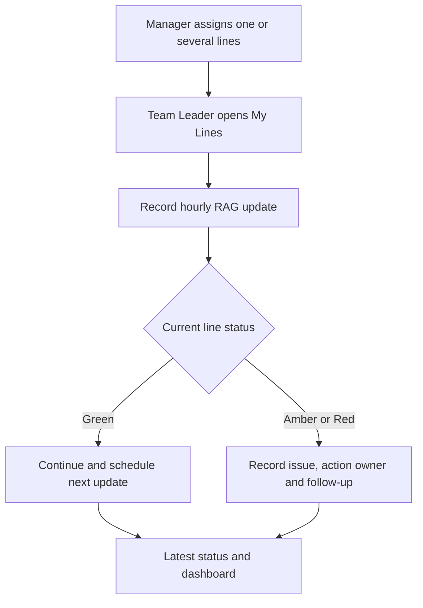
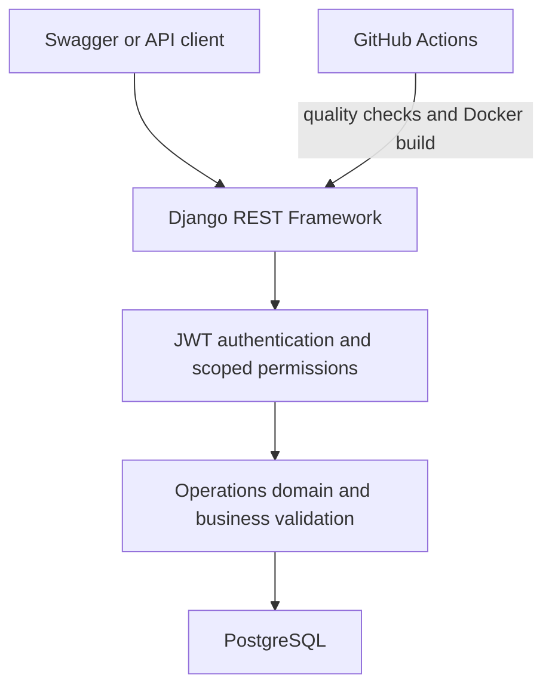
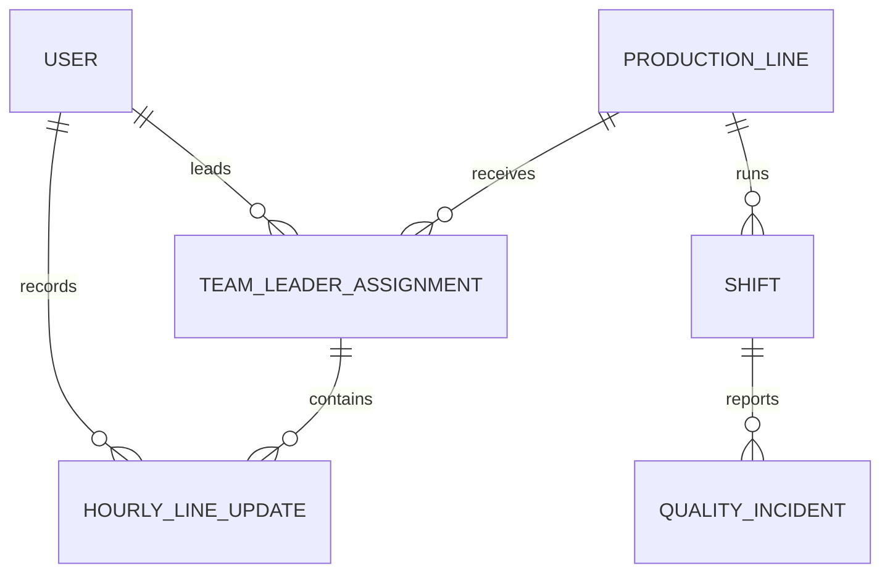

# Production Operations API

[](https://github.com/MasumTech/production-ops-api/actions/workflows/ci.yml)
[](https://www.python.org/)
[](https://www.djangoproject.com/)
[](https://www.docker.com/)
[](LICENSE)

A production-focused REST API for manufacturing line ownership, hourly RAG status, shift KPIs, downtime, and quality incidents.

Built with Django REST Framework, JWT authentication, PostgreSQL, Docker, automated testing, and continuous integration.

**Portfolio scope:** Backend API engineering focused on production workflows, data integrity, access control, automated quality gates, and containerized delivery.

[Problem](#the-real-world-problem) · [Scenario](#representative-shift-scenario) · [Workflow](#operational-workflow) · [Capabilities](#key-capabilities) · [Architecture](#system-architecture) · [API](#api-endpoints) · [Run locally](#quick-start-with-docker)

## The Real-World Problem

On a normal manufacturing shift, a Team Leader may run one production line. During busy periods, absence cover, or changing production demand, the same person may temporarily coordinate two or three lines. If one line slows or stops because of a material blockage, equipment fault, quality concern, or staffing issue, verbal updates and paper notes quickly become incomplete or outdated.

Each line remains a separate date- and shift-specific assignment. The API therefore makes multi-line responsibility visible without treating “three lines” as a hard-coded limit.

The API addresses five operational control gaps:

- unclear ownership when one Team Leader covers several lines
- no consistent way to show the current Green, Amber, or Red condition
- delayed escalation when an issue needs engineering or management support
- missing action owners, next-update deadlines, and follow-up evidence
- time lost asking several people for the latest position during the shift

## Representative Shift Scenario

| Moment | Operational risk | System response |
|---|---|---|
| Shift start | One Team Leader is covering Lines 01, 02, and 03 | Management creates dated, shift-specific line assignments |
| Line 02 slows or blocks | The issue may be shared verbally but not recorded consistently | The Team Leader submits an Amber or Red update with the issue summary |
| Support is requested | Nobody is clearly responsible for the action or deadline | The update records the action, owner, support required, and next-update time |
| Management reviews the floor | Staff must call each line to discover the current position | `latest-status` returns one current update for every accessible assignment |
| Shift follow-up | Previous decisions and escalation history may be lost | Timestamped records preserve who reported the issue and what happened next |

## Operational Workflow



## RAG Status and Escalation Rules

| Status | Typical condition | Operational response | API-enforced rule |
|---|---|---|---|
| `Green` | Stable and operating as expected | Continue production and schedule the next check | Next-update time must be later than the recorded time |
| `Amber` | At risk but still running or recoverable | Record the issue, action, owner/support, and monitor closely | Issue summary and a future next-update time are required |
| `Red` | Stopped or critically constrained | Escalate immediately and maintain a follow-up trail | Issue summary, follow-up flag, and a future next-update time are required |

## Key Capabilities

| Area | Capability | Operational value |
|---|---|---|
| Workforce coordination | Date- and shift-specific Team Leader assignments across one or several lines | Makes line ownership explicit |
| Live line control | Green, Amber, and Red updates with issues, actions, owners, support needs, and deadlines | Shows the current condition and required response |
| Production performance | Planned output, actual output, downtime, and calculated performance percentage | Turns shift activity into measurable KPIs |
| Quality incident management | Category, severity, lifecycle status, root cause, and corrective action | Supports structured investigation and closure |
| Management oversight | Dashboard aggregates, latest status, search, filtering, and ordering | Reduces manual status chasing |
| API usability | JWT authentication, pagination, validation, health checks, OpenAPI schema, and Swagger UI | Provides a predictable integration surface |
| Delivery and reliability | Automated tests, Ruff, GitHub Actions, Docker Compose, Gunicorn, and health checks | Demonstrates a repeatable production-style delivery process |

## Expected Operational Value

- Clear responsibility across several production lines during the same shift
- Faster visibility of stopped, at-risk, and stable lines
- Consistent escalation with named owners and next-update deadlines
- Less reliance on radio calls, paper notes, and fragmented spreadsheets
- An auditable operational history for management and shift handovers
- Scoped visibility: Team Leaders see their own lines while staff retain oversight

## System Architecture



## Core Data Model



## Access Control Matrix

| Role | Visibility | Allowed actions |
|---|---|---|
| Public visitor | Health check, OpenAPI schema, and Swagger UI | Obtain or refresh JWT tokens; no operations data access |
| Authenticated operations user | Production lines, shifts, incidents, and dashboard | Create, update, and delete production lines, shifts, and quality incidents |
| Assigned Team Leader | Own line assignments and own hourly updates | Create, update, and delete hourly updates for assigned lines only |
| Management staff | All assignments and hourly updates | Create, update, and delete assignments; manage all hourly updates |

## Data Integrity and Business Rules

| Domain | Enforced rule |
|---|---|
| Production line | Line code is unique; status is Active, Inactive, or Maintenance |
| Shift | One shift per line/date/type; start and end times must differ; performance is calculated from actual versus planned output |
| Quality incident | Resolution cannot precede occurrence; Resolved or Closed incidents require a resolution time |
| Line assignment | One assignee per line/date/shift; inactive users and inactive lines cannot receive new assignments |
| Hourly update | Team Leaders can use only their own assignments; Amber/Red need an issue summary; Red requires follow-up |
| Audit trail | Reporter/recorder is captured from the authenticated user; update deadlines must be in the future |

## Engineering Highlights

- Relational domain modelling with database constraints and targeted indexes
- Assignment-scoped access control for Team Leaders and management staff
- Business validation for incident resolution, line status, and follow-up deadlines
- Efficient related-object loading and aggregate dashboard queries
- Versioned migrations, interactive OpenAPI documentation, and JWT authentication
- Automated formatting, linting, system checks, tests, Compose validation, and Docker builds
- Non-root Gunicorn container with application and PostgreSQL health checks


## Technology Stack

| Area | Technology |
|---|---|
| Language | Python 3.12 |
| Framework | Django 5.2 |
| API | Django REST Framework |
| Authentication | Simple JWT |
| Database | PostgreSQL 16 |
| API documentation | drf-spectacular / Swagger UI |
| Application server | Gunicorn |
| Containers | Docker and Docker Compose |
| Testing | pytest and pytest-django |
| Code quality | Ruff |
| Continuous integration | GitHub Actions |

## Domain Model Responsibilities

| Model | Responsibility | Key data and behaviour |
|---|---|---|
| `TimeStampedModel` | Shared audit base | Adds `created_at` and `updated_at` to domain records |
| `ProductionLine` | Manufacturing line master data | Unique code, name, location, hourly target, and operational status |
| `Shift` | Production result for a line and shift | Supervisor, times, planned/actual output, downtime, notes, and calculated performance |
| `QualityIncident` | Quality and operational issue lifecycle | Category, severity, status, actions, root cause, corrective action, occurrence, resolution, and reporter |
| `TeamLeaderAssignment` | Line ownership for a date and shift | Team Leader, line, assignment creator, and notes; supports multi-line responsibility |
| `HourlyLineUpdate` | Timestamped RAG condition for an assigned line | Product, issue, action, owner, support required, follow-up, recorder, and next-update deadline |
## API Endpoints

| Method | Endpoint | Description |
|---|---|---|
| `POST` | `/api/auth/token/` | Obtain JWT access and refresh tokens |
| `POST` | `/api/auth/token/refresh/` | Refresh an access token |
| `GET` | `/api/schema/` | Download the OpenAPI schema |
| `GET` | `/api/docs/` | Open Swagger API documentation |
| `GET, POST` | `/api/production-lines/` | List or create production lines |
| `GET, PUT, PATCH, DELETE` | `/api/production-lines/{id}/` | Manage one production line |
| `GET, POST` | `/api/shifts/` | List or create shifts |
| `GET, PUT, PATCH, DELETE` | `/api/shifts/{id}/` | Manage one shift |
| `GET, POST` | `/api/quality-incidents/` | List or create quality incidents |
| `GET, PUT, PATCH, DELETE` | `/api/quality-incidents/{id}/` | Manage one quality incident |
| `GET` | `/api/health/` | Check application and database health |
| `GET` | `/api/dashboard/summary/` | Return aggregated production and incident KPIs |
| `GET, POST` | `/api/team-leader-assignments/` | List or create line assignments |
| `GET, PUT, PATCH, DELETE` | `/api/team-leader-assignments/{id}/` | Manage one line assignment |
| `GET` | `/api/team-leader-assignments/my-lines/` | List the current user’s assigned lines |
| `GET, POST` | `/api/hourly-line-updates/` | List or create hourly line updates |
| `GET, PUT, PATCH, DELETE` | `/api/hourly-line-updates/{id}/` | Manage one accessible hourly update |
| `GET` | `/api/hourly-line-updates/latest-status/` | Return the latest update for every accessible assignment |

Business operations endpoints, including the dashboard and resource routes, require a JWT access token:

```http
Authorization: Bearer <access-token>
```

## Example Hourly Status Response

```json
{
  "id": 42,
  "assignment": 7,
  "production_line_code": "LINE-01",
  "production_line_name": "Primary Packing Line",
  "team_leader_username": "team.leader",
  "status": "amber",
  "current_product": "Demo Product A",
  "issue_summary": "Output is below the hourly target.",
  "action_taken": "Engineering support requested.",
  "requires_follow_up": true,
  "recorded_by_username": "team.leader",
  "next_update_due_at": "2026-08-26T15:30:00Z"
}
```

## Pagination

List endpoints return a maximum of 20 records per page.

```json
{
  "count": 21,
  "next": "http://localhost:8000/api/production-lines/?page=2",
  "previous": null,
  "results": []
}
```

Request another page using the `page` query parameter:

```text
/api/production-lines/?page=2
/api/shifts/?page=2
/api/quality-incidents/?page=2
```

Pagination can be combined with filtering, search, and ordering:

```text
/api/production-lines/?status=active&page=2
/api/shifts/?ordering=-actual_output&page=2
```

## Search, Filtering, and Ordering

| Resource | Filters | Search and ordering |
|---|---|---|
| Production lines | `status` | Search code/name/location; order by code/name/status/created time |
| Shifts | `production_line`, `shift_type`, `date` | Search line/supervisor/notes; order by date/output/downtime/created time |
| Quality incidents | `status`, `severity`, `category`, `shift` | Search title/description/root cause/line; order by occurrence/resolution/severity/status |
| Team Leader assignments | `date`, `shift_type`, `production_line` | Search line/leader; order by date/shift/line/leader |
| Hourly line updates | `date`, `shift_type`, `production_line`, `status`, `requires_follow_up` | Search line/leader/product/issue/action/support; order by recorded time/deadline/status/line |
| Dashboard summary | `date_from`, `date_to` | Aggregates only the selected date range |

Representative queries:

```text
/api/production-lines/?status=active&search=packing
/api/shifts/?production_line=1&shift_type=day&ordering=-actual_output
/api/quality-incidents/?severity=critical&status=open
/api/team-leader-assignments/my-lines/?date=2026-08-26&shift_type=day
/api/hourly-line-updates/?status=red&requires_follow_up=true
/api/hourly-line-updates/latest-status/?status=amber
/api/dashboard/summary/?date_from=2026-08-01&date_to=2026-08-31
```

`date_from` and `date_to` use `YYYY-MM-DD`. The API returns `400 Bad Request` when `date_from` is later than `date_to`. Invalid typed filters, such as an invalid date or status, are also rejected.
## Quick Start with Docker

### Prerequisites

- Docker Desktop
- Docker Compose
- Git

### 1. Clone the repository

```bash
git clone git@github.com:MasumTech/production-ops-api.git
cd production-ops-api
```

### 2. Create the Docker environment file

```bash
cp .env.docker.example .env.docker
```

Update the placeholder secrets inside `.env.docker` before using the application outside local development.

### 3. Start the application

```bash
docker compose up --build -d
```

### 4. Apply database migrations

```bash
docker compose exec web python manage.py migrate
```

### 5. Create an administrator

```bash
docker compose exec web python manage.py createsuperuser
```

The application will be available at:

| Service | URL |
|---|---|
| Swagger documentation | http://localhost:8000/api/docs/ |
| Django admin | http://localhost:8000/admin/ |
| OpenAPI schema | http://localhost:8000/api/schema/ |

Check the running containers:

```bash
docker compose ps
```

View application logs:

```bash
docker compose logs --tail=50 web
```

Stop the containers:

```bash
docker compose down
```

The PostgreSQL data remains stored in the named Docker volume after the containers stop.

## Local Development

### 1. Create and activate a virtual environment

```bash
python3 -m venv .venv
source .venv/bin/activate
```

### 2. Install dependencies

```bash
python -m pip install --upgrade pip
python -m pip install -r requirements.txt
```

### 3. Create the local environment file

```bash
cp .env.example .env
```

The default local configuration uses SQLite, so PostgreSQL is not required for this setup.

### 4. Apply migrations and start Django

```bash
python manage.py migrate
python manage.py createsuperuser
python manage.py runserver
```

## Authentication Example

Request JWT tokens:

```bash
curl -X POST http://localhost:8000/api/auth/token/ \
  -H "Content-Type: application/json" \
  -d '{"username":"your-username","password":"your-password"}'
```

Use the returned access token:

```bash
curl http://localhost:8000/api/production-lines/ \
  -H "Authorization: Bearer <access-token>"
```

## Testing and Code Quality

The current suite contains **54 automated tests** covering models, API behaviour, authentication, permissions, filters, dashboard aggregation, health checks, and validation.

Run the complete test suite:

```bash
python -m pytest
```

Check Django configuration:

```bash
python manage.py check
```

Check code formatting:

```bash
python -m ruff format --check .
```

Run lint checks:

```bash
python -m ruff check .
```

Check whitespace errors:

```bash
git diff --check
```

## Continuous Integration

GitHub Actions automatically runs the following checks for changes targeting `main`:

1. Dependency installation
2. Ruff formatting check
3. Ruff lint check
4. Django system check
5. pytest test suite
6. Docker Compose configuration validation
7. Docker image build

## Project Structure

```text
production-ops-api/
├── .github/workflows/ci.yml    # Automated quality and Docker checks
├── config/
│   ├── settings.py             # Environment-driven Django/DRF settings
│   ├── urls.py                 # Auth, schema, docs, health, and app routes
│   └── health.py               # Application and database readiness check
├── operations/
│   ├── models.py               # Production domain and integrity rules
│   ├── serializers.py          # API representation and validation
│   ├── permissions.py          # Staff and assignment-scoped access
│   ├── views.py                # CRUD, filters, dashboard, and custom actions
│   ├── urls.py                 # DRF router registrations
│   ├── admin.py                # Django admin configuration
│   ├── migrations/             # Versioned database schema
│   ├── tests.py                # Model tests
│   └── test_api.py             # API, permission, and workflow tests
├── Dockerfile                  # Non-root Gunicorn image
├── compose.yml                 # Django and PostgreSQL services
├── requirements.txt            # Pinned Python dependencies
├── ruff.toml                   # Formatting and lint rules
└── README.md                   # Case study and operating guide
```

## Author

**Md Masum Reza**

- GitHub: [MasumTech](https://github.com/MasumTech)