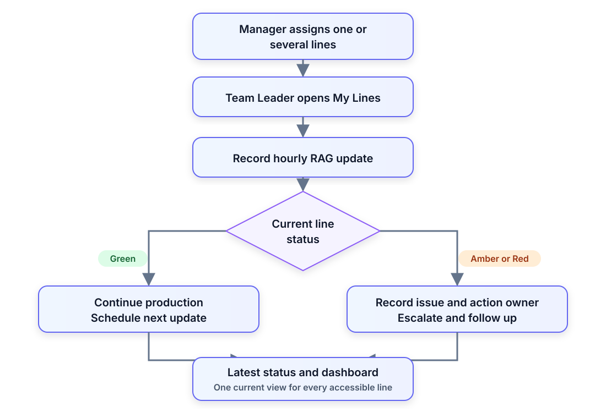
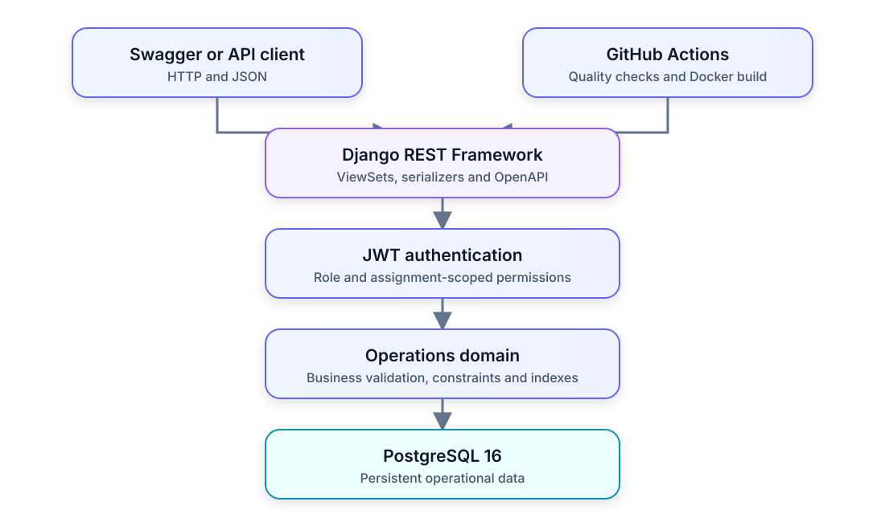
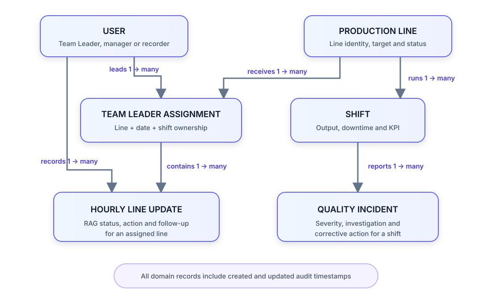

# Multi-Line Production Operations Platform

**Backend API for the Multi-Line Team Leader Digital Solution**

[](https://github.com/MasumTech/production-ops-api/actions/workflows/ci.yml)
[](https://www.python.org/)
[](https://www.djangoproject.com/)
[](https://www.docker.com/)
[](LICENSE)

A production-focused platform for coordinating two or three manufacturing lines through clear ownership, hourly RAG status, issue escalation, shift KPIs, downtime, and quality records.

This repository implements the Django REST Framework backend, React + TypeScript Team Leader PWA, and Operations Manager web console using JWT authentication, PostgreSQL, Docker, automated testing, and continuous integration.

**Current repository scope:** The Multi-Line Production Operations API, Team Leader tablet PWA, and Operations Manager console, focused on production workflows, fast shopfloor capture, management-wide priority visibility, data integrity, access control, automated quality gates, and containerized delivery.

**Product direction:** The wider platform will add operational analytics, explainable risk briefing, and optional mobile access after the tablet, manager, and live-event workflows are validated.

[Scope](#product-scope-and-naming) · [Problem](#the-real-world-problem) · [Scenario](#representative-shift-scenario) · [Workflow](#operational-workflow) · [Capabilities](#key-capabilities) · [Roadmap](#product-roadmap) · [Architecture](#system-architecture) · [API](#api-endpoints) · [Run locally](#quick-start-with-docker)

## Product Scope and Naming

| Layer | Name | Purpose |
|---|---|---|
| Complete product | **Multi-Line Production Operations Platform** | The full tablet, web, backend, live-event, analytics, and future mobile direction |
| Operational proposal | **Multi-Line Team Leader Digital Solution** | The management-facing workflow for one Team Leader coordinating two or three production lines |
| Current repository | **Multi-Line Production Operations Platform foundation** | The implemented Django backend, business rules, Team Leader tablet workflow, Operations Manager console, access control, and operational data |

The repository slug remains `production-ops-api` so existing GitHub, clone, CV, and portfolio links stay stable while the wider product develops in phases.

## The Real-World Problem

On a normal manufacturing shift, a Team Leader may run one production line. During busy periods, absence cover, or changing production demand, the same person may temporarily coordinate two or three lines. If one line slows or stops because of a material blockage, equipment fault, quality concern, or staffing issue, verbal updates and paper notes quickly become incomplete or outdated.

Each line remains a separate date- and shift-specific assignment. The API therefore makes multi-line responsibility visible without treating “three lines” as a hard-coded limit.

The API addresses five operational control gaps:

- unclear ownership when one Team Leader covers several lines
- no consistent way to show the current Green, Amber, or Red condition
- delayed escalation when an issue needs engineering or management support
- missing action owners, next-update deadlines, and follow-up evidence
- time lost asking several people for the latest position during the shift

## Representative Shift Scenario

| Moment | Operational risk | System response |
|---|---|---|
| Shift start | One Team Leader is covering Lines 01, 02, and 03 | Management creates dated, shift-specific line assignments |
| Line 02 slows or blocks | The issue may be shared verbally but not recorded consistently | The Team Leader submits an Amber or Red update with the issue summary |
| Support is requested | Nobody is clearly responsible for the action or deadline | The update records the action, owner, support required, and next-update time |
| Management reviews the floor | Staff must call each line to discover the current position | `latest-status` returns one current update for every accessible assignment |
| Shift follow-up | Previous decisions and escalation history may be lost | Timestamped records preserve who reported the issue and what happened next |

## Operational Workflow



## RAG Status and Escalation Rules

| Status | Typical condition | Operational response | API-enforced rule |
|---|---|---|---|
| `Green` | Stable and operating as expected | Continue production and schedule the next check | Next-update time must be later than the recorded time |
| `Amber` | At risk but still running or recoverable | Record the issue, action, owner/support, and monitor closely | Issue summary and a future next-update time are required |
| `Red` | Stopped or critically constrained | Escalate immediately and maintain a follow-up trail | Issue summary, follow-up flag, and a future next-update time are required |

## Key Capabilities

| Area | Capability | Operational value |
|---|---|---|
| Workforce coordination | Date- and shift-specific Team Leader assignments across one or several lines | Makes line ownership explicit |
| Live line control | Green, Amber, and Red updates with issues, actions, owners, support needs, and deadlines | Shows the current condition and required response |
| Product and material readiness | Ordered product sequence with Ready, In Process, Short, and Held states, recovery ownership, expected availability, and release audit | Makes the next production risk visible before it stops the line |
| Production performance | Planned output, actual output, downtime, and calculated performance percentage | Turns shift activity into measurable KPIs |
| Quality incident management | Category, severity, lifecycle status, root cause, and corrective action | Supports structured investigation and closure |
| Management oversight | Dashboard aggregates, latest status, search, filtering, and ordering | Reduces manual status chasing |
| API usability | JWT authentication, pagination, validation, health checks, OpenAPI schema, and Swagger UI | Provides a predictable integration surface |
| Delivery and reliability | Automated tests, Ruff, GitHub Actions, Docker Compose, Daphne ASGI, Redis, and health checks | Demonstrates a repeatable production-style delivery process |
| Operational escalation | Structured category, priority, response owner, deadline, acknowledgement, resolution, and attention queue | Turns a reported blocker into an owned and auditable response |
| Shift handover | Unresolved escalation carry-over between consecutive assignments with receiver acceptance | Preserves ownership, deadlines, and operational context across shift changes |
| Break and recovery control | Planned cover, cover acceptance, controlled break start, recovery confirmation, and late-return attention | Keeps temporary line responsibility explicit while a Team Leader is away |
| Team Leader tablet PWA | My Lines, line updates, escalation, materials, break/recovery, and handover actions in an installable responsive interface | Turns the API workflows into a fast shopfloor control surface |
| Operations Manager console | Five focused desktop/mobile workspaces for overview, priority-sorted line control, actions and materials, daily risk briefing, and loss analytics | Gives management fast access to each operational view without one long scrolling dashboard or repeated status calls |
| Explainable risk briefing | Manager-facing deterministic per-line risk scores, ordered evidence, data-completeness confidence, and missing-data warnings | Gives authorised managers a traceable daily briefing without allowing software to control production |

## Expected Operational Value

- Clear responsibility across several production lines during the same shift
- Faster visibility of stopped, at-risk, and stable lines
- Consistent escalation with named owners and next-update deadlines
- Earlier visibility of material shortages, held products, recovery ownership, and expected availability
- Less reliance on radio calls, paper notes, and fragmented spreadsheets
- An auditable operational history for management and shift handovers
- Scoped visibility: Team Leaders see their own lines while staff retain oversight
- Visible overdue, critical, and unassigned escalations with acknowledgement evidence
- Explicit temporary cover, missed-start visibility, late-return attention, and recovery evidence

## Product Roadmap

This repository is the API, Team Leader tablet, Operations Manager console, and live-event foundation for the wider **Multi-Line Production Operations Platform** and its **Multi-Line Team Leader Digital Solution** workflow. The sequence below keeps the solution useful and safe: prove the workflow first, build reliable operational data next, then add broader interfaces, live events, analytics, and only later consider AI.

Roadmap completion is tracked by the published delivery phases and their defined acceptance scope; it is a feature-state measure, not an engineering-hours estimate. All eleven published phases now have a production-shaped implementation, so the published product roadmap is **100% complete**. The Phase 9 briefing remains deterministic and explainable; generative narrative and third-party notification providers are still future, separately governed options.

| Phase | Scope | Main users/interface | Status |
|---|---|---|---|
| 1. Operations foundation | Production lines, shifts, output, downtime, quality incidents, dashboard, JWT, PostgreSQL, Docker, CI, health checks | API, Swagger, Django Admin | **Built** |
| 2. Multi-line control | Date/shift assignments, `my-lines`, hourly RAG updates, owners, deadlines, follow-up, `latest-status` | Team Leader and management API | **Built** |
| 3. Product and material readiness | Product sequence, READY/IN PROCESS/SHORT/HELD state, shortage quantity, owner, expected availability, authorised release visibility | Batcher, Team Leader, Operations | **Built** |
| 4. Handover and recovery workflows | Structured issue categories, acknowledgements, unresolved-item handover, break/recovery controls, overdue/no-owner rules | Team Leader, incoming lead, cover user, Operations | **Built** |
| 5. Tablet-first frontend | My Lines, Raise Issue, Materials, Break & Recovery, and Handover in a fast responsive PWA | Team Leader tablet | **Built** |
| 6. Manager web console | Live Floor priority board, all-line status, output position, open actions, late updates, and current material risk | Operations desktop/laptop | **Built** |
| 7. Real-time event layer | Live status delivery, support notifications, overdue reminders, bounded offline outbox, idempotent replay, and cursor-based safe re-sync | Tablet and web interfaces | **Built** |
| 8. Loss and asset analytics | Repeated fault history, downtime impact, material delays, recurring line combinations, repair-versus-replace evidence | Operations and Engineering | **Built** |
| 9. AI daily risk briefing | Explainable plan-completion, downtime, and material-delay risk with confidence and missing-data warnings | Authorised managers/support roles | **Deterministic API and Manager Console briefing built; AI narrative future** |
| 10. Mobile support companion | Focused alerts, one-tap acknowledgement, related line/material context, realtime refresh, and offline-safe retry using the same API | Approved support users | **Built** |
| 11. Pilot readiness and administration | In-app notification inbox/read evidence, reminder-worker heartbeat, pilot monitoring, audited workspace-role control, and responsive manager administration | Operations management and all authenticated workspaces | **Built** |

### Proposed Product Architecture

| Layer | Proposed direction | Why |
|---|---|---|
| Backend and API | Continue with Django, DRF, PostgreSQL, and versioned REST endpoints | Reuses the tested foundation and keeps business rules central |
| Tablet frontend | React + TypeScript responsive Progressive Web App | Provides an installable Team Leader workflow with app-shell caching and clear offline state |
| Manager frontend | React + TypeScript role-gated web console with live delivery and a polling fallback | Separates shopfloor speed from management-wide oversight while reusing shared contracts |
| Live updates | Django Channels/WebSockets, Redis fan-out, and a durable PostgreSQL event cursor | Pushes scoped change notifications and safely recovers missed events without duplicating business state |
| Background work | Dedicated reminder worker now; Celery remains an option for later scheduled analytics/reporting | Keeps overdue scanning outside API requests without expanding Phase 7 into analytics |
| Support mobile | Role-gated responsive PWA; consider React Native/Expo only if native notifications, scanning, or stronger offline use is justified | Delivers a focused companion without maintaining a second client |
| Delivery | Containerised services, managed PostgreSQL, monitoring, backups, and staged environments | Provides a controlled route from prototype to pilot and production |

## Safety and Product Boundaries

- Make the line safe and follow approved safety, food-safety, quality, product-hold, engineering, and escalation procedures **before** entering a software update.
- The product supports visibility and coordination; it does not replace authorised checks, release records, traceability, HR decisions, or official production systems.
- Tablet or Wi-Fi failure must not stop the process. Approved verbal communication and paper/whiteboard fallback remain available.
- Start with generic dummy data, then a controlled process pilot, then a limited software pilot only after Operations, QA, Health and Safety, Engineering, HR, and IT approval.
- Deterministic rules come before prediction. AI remains advisory and cannot start/stop a line, release product, set staffing, move breaks, raise line speed, or order repair/replacement.
- Tablet remains the primary Team Leader interface. The mobile companion is limited to approved support users and assigned response context.

## System Architecture



## Core Data Model



## Access Control Matrix

| Role | Visibility | Allowed actions |
|---|---|---|
| Public visitor | Health check, OpenAPI schema, and Swagger UI | Obtain or refresh JWT tokens; no operations data access |
| Authenticated operations user | Production lines, shifts, incidents, and dashboard | Create, update, and delete production lines, shifts, and quality incidents |
| Assigned Team Leader | Own line assignments, hourly updates, and product/material readiness | Manage hourly updates and readiness for assigned lines; cannot release held material |
| Management staff | All assignments, hourly updates, and product/material readiness | Manage all records and perform the audited release of held material |
| Incoming Team Leader | Handovers and unresolved escalations carried into own assignment | Review operational context and explicitly accept a pending handover |
| Nominated break cover | Break records where the authenticated user is nominated as cover | Review line context and explicitly accept temporary coverage |
| Authenticated tablet user | Safe active-user choices and later same-line assignment options | Select response owners, cover users, and valid handover receivers without exposing email data |

## Data Integrity and Business Rules

| Domain | Enforced rule |
|---|---|
| Production line | Line code is unique; status is Active, Inactive, or Maintenance |
| Shift | One shift per line/date/type; start and end times must differ; performance is calculated from actual versus planned output |
| Quality incident | Resolution cannot precede occurrence; Resolved or Closed incidents require a resolution time |
| Line assignment | One assignee per line/date/shift; inactive users and inactive lines cannot receive new assignments |
| Hourly update | Team Leaders can use only their own assignments; Amber/Red need an issue summary; Red requires follow-up |
| Product/material readiness | Sequence is unique per assignment; Short requires quantity, owner, and expected availability; Held requires a reason and staff release |
| Audit trail | Reporter/recorder is captured from the authenticated user; update deadlines must be in the future |
| Shift handover | Assignments must use the same line and move forward in date/shift order; only unresolved escalations are carried; acceptance captures receiver and time |
| Break and recovery | One open break per assignment; cover must be active and different from the Team Leader; coverage acceptance precedes start; recovery requires notes and audit data |

## Engineering Highlights

- Relational domain modelling with database constraints and targeted indexes
- Assignment-scoped access control for Team Leaders and management staff
- Audited staff-only release workflow for held product and material records
- Business validation for incident resolution, line status, and follow-up deadlines
- Efficient related-object loading and aggregate dashboard queries
- Versioned migrations, interactive OpenAPI documentation, and JWT authentication
- Automated formatting, linting, system checks, tests, Compose validation, and Docker builds
- Non-root Daphne ASGI container with application, PostgreSQL, and Redis health checks
- Four-stage break workflow with cover acceptance, recovery evidence, cancellation audit, and overdue visibility
- Tablet-first responsive PWA with session-scoped JWT refresh, accessible controls, offline-state warning, and API-backed workflow actions
- Frontend type checking, component/API-client tests, production build, service-worker generation, and container build in CI
- Staff-only Operations Manager console with matching desktop sidebar and mobile bottom navigation across overview, line control, actions and materials, risk briefing, and loss analytics
- Role-gated Mobile Support Companion with matching five-section navigation, assigned critical/overdue actions, related line and material context, and one-tap offline-safe acknowledgement
- Shared user-scoped notification centre with durable read receipts, realtime refresh, and offline-safe read replay across Team Leader, Manager, and Support workspaces
- Staff-only Pilot Admin workspace with reminder-worker freshness, notification/event health, operational backlog, and audited Support/Team Leader role changes
- JWT-authenticated WebSocket delivery with staff/participant scoping, PostgreSQL cursor replay, Redis fan-out, deduplicated overdue reminders, and bounded offline action replay
- Staff-only daily risk briefing API and responsive Manager Console view with versioned deterministic scoring, ordered source evidence, bounded queries, completeness confidence, explicit missing-data warnings, and retry-safe failure handling


## Technology Stack

| Area | Technology |
|---|---|
| Language | Python 3.12 |
| Framework | Django 5.2 |
| API | Django REST Framework |
| Authentication | Simple JWT |
| Database | PostgreSQL 16 |
| API documentation | drf-spectacular / Swagger UI |
| ASGI application server | Daphne |
| Event fan-out | Django Channels and Redis |
| Containers | Docker and Docker Compose |
| Testing | pytest and pytest-django |
| Code quality | Ruff |
| Continuous integration | GitHub Actions |
| Tablet and manager frontend | React 19, TypeScript, Vite, Vitest, and Vite PWA |
| Frontend delivery | Nginx container with same-origin API proxy and SPA fallback |

## Domain Model Responsibilities

| Model | Responsibility | Key data and behaviour |
|---|---|---|
| `TimeStampedModel` | Shared audit base | Adds `created_at` and `updated_at` to domain records |
| `ProductionLine` | Manufacturing line master data | Unique code, name, location, hourly target, and operational status |
| `Shift` | Production result for a line and shift | Supervisor, times, planned/actual output, downtime, notes, and calculated performance |
| `QualityIncident` | Quality and operational issue lifecycle | Category, severity, status, actions, root cause, corrective action, occurrence, resolution, and reporter |
| `TeamLeaderAssignment` | Line ownership for a date and shift | Team Leader, line, assignment creator, and notes; supports multi-line responsibility |
| `HourlyLineUpdate` | Timestamped RAG condition for an assigned line | Product, issue, action, owner, support required, follow-up, recorder, and next-update deadline |
| `ProductMaterialReadiness` | Ordered product and material state for an assigned line | Sequence, product, planned and shortage quantities, owner, expected availability, hold reason, creator, and release audit |
| `OperationalEscalation` | Audited response lifecycle for a line blocker | Source update/incident, category, priority, owner, deadline, acknowledgement, resolution, overdue and attention state |
| `ShiftHandover` | Controlled transfer between consecutive line assignments | Outgoing/incoming assignments, unresolved escalations, operational summary, creator, receiver, and acceptance audit |
| `BreakRecovery` | Temporary line-control workflow during a Team Leader break | Assignment, nominated cover, planned timing, acceptance, start, recovery, cancellation, attention state, and audit users |
| `OperationalEvent` | Durable change cursor for live delivery and safe reconnect | Event type, source resource, line/assignment scope, severity, minimal metadata, recipients, and occurrence time |
| `OperationalEventReadReceipt` | User-specific notification visibility evidence | Event, user, and first-read timestamp with a unique event/user constraint |
| `OperationalWorkerHeartbeat` | Pilot monitoring evidence for the reminder worker | Worker name, latest start/completion, safe error type, and published count |
| `IdempotentRequest` | Safe replay receipt for queued POST requests | User-scoped UUID, request fingerprint, stored response, and completion time |

## API Endpoints

| Method | Endpoint | Description |
|---|---|---|
| `POST` | `/api/auth/token/` | Obtain JWT access and refresh tokens |
| `POST` | `/api/auth/token/refresh/` | Refresh an access token |
| `GET` | `/api/auth/me/` | Return the authenticated user's safe tablet profile |
| `GET` | `/api/active-users/` | List safe active-user choices without email addresses |
| `GET` | `/api/schema/` | Download the OpenAPI schema |
| `GET` | `/api/docs/` | Open Swagger API documentation |
| `GET, POST` | `/api/production-lines/` | List or create production lines |
| `GET, PUT, PATCH, DELETE` | `/api/production-lines/{id}/` | Manage one production line |
| `GET, POST` | `/api/shifts/` | List or create shifts |
| `GET, PUT, PATCH, DELETE` | `/api/shifts/{id}/` | Manage one shift |
| `GET, POST` | `/api/quality-incidents/` | List or create quality incidents |
| `GET, PUT, PATCH, DELETE` | `/api/quality-incidents/{id}/` | Manage one quality incident |
| `GET` | `/api/health/` | Check application and database health |
| `GET` | `/api/dashboard/summary/` | Return aggregated production and incident KPIs |
| `GET` | `/api/support/companion/` | Return the approved support user’s assigned unresolved actions and related line/material context |
| `GET` | `/api/notifications/` | Return up to 50 unread events already visible to the authenticated user |
| `POST` | `/api/notifications/{event_id}/read/` | Record repeatable user-specific notification read evidence |
| `GET` | `/api/pilot/status/` | Return staff-only pilot health, worker freshness, delivery and backlog evidence |
| `GET, POST` | `/api/workspace-roles/` | List workspace roles or assign Team Leader/Operational Support access as management staff |
| `GET, POST` | `/api/team-leader-assignments/` | List or create line assignments |
| `GET, PUT, PATCH, DELETE` | `/api/team-leader-assignments/{id}/` | Manage one line assignment |
| `GET` | `/api/team-leader-assignments/my-lines/` | List the current user’s assigned lines |
| `GET` | `/api/team-leader-assignments/{id}/handover-options/` | List valid later same-line assignments for handover |
| `GET, POST` | `/api/hourly-line-updates/` | List or create hourly line updates |
| `GET, PUT, PATCH, DELETE` | `/api/hourly-line-updates/{id}/` | Manage one accessible hourly update |
| `GET` | `/api/hourly-line-updates/latest-status/` | Return the latest update for every accessible assignment |
| `GET, POST` | `/api/product-material-readiness/` | List or create accessible product/material readiness items |
| `GET, PUT, PATCH, DELETE` | `/api/product-material-readiness/{id}/` | Manage one accessible readiness item |
| `POST` | `/api/product-material-readiness/{id}/release/` | Staff-only audited release of a held item |
| `GET, POST` | `/api/operational-escalations/` | List visible escalations or raise one for an assigned line |
| `GET` | `/api/operational-escalations/{id}/` | Retrieve one visible escalation |
| `POST` | `/api/operational-escalations/{id}/acknowledge/` | Assigned owner or staff acknowledgement |
| `POST` | `/api/operational-escalations/{id}/resolve/` | Resolve an acknowledged escalation with notes |
| `GET` | `/api/operational-escalations/attention-required/` | List visible overdue, critical, or unassigned escalations |
| `GET, POST` | `/api/shift-handovers/` | List participant-visible handovers or create one from an owned assignment |
| `GET` | `/api/shift-handovers/{id}/` | Retrieve one participant-visible handover |
| `POST` | `/api/shift-handovers/{id}/accept/` | Incoming Team Leader or staff acceptance |
| `GET, POST` | `/api/break-recoveries/` | List participant-visible break records or create a plan for an owned assignment |
| `GET` | `/api/break-recoveries/{id}/` | Retrieve one participant-visible break record |
| `POST` | `/api/break-recoveries/{id}/accept-coverage/` | Nominated cover-user acceptance |
| `POST` | `/api/break-recoveries/{id}/start/` | Assigned Team Leader or staff starts an accepted break |
| `POST` | `/api/break-recoveries/{id}/recover/` | Assigned Team Leader or staff confirms recovery with notes |
| `POST` | `/api/break-recoveries/{id}/cancel/` | Assigned Team Leader or staff cancels an unstarted plan with a reason |
| `GET` | `/api/operational-events/?after={cursor}` | List participant-scoped events after a durable cursor |
| `GET` | `/api/operational-events/cursor/` | Return the latest event cursor visible to the authenticated user |
| `GET` | `/api/analytics/loss-assets/` | Return staff-only deterministic loss and recurring-asset evidence |
| `GET` | `/api/analytics/daily-risk-briefing/` | Return the staff-only explainable daily operational risk briefing |

The frontend opens `/ws/operations/?after={cursor}` with the JWT supplied through the WebSocket subprotocol, not the URL. The server replays up to 100 visible missed events; larger gaps trigger an authoritative REST refresh. WebSocket events are change notifications, not copies of official production records. Notification read evidence confirms visibility only; it does not acknowledge or resolve the underlying operational action.

Queued offline POST requests include a user-scoped UUID `Idempotency-Key`. Identical retries replay the stored response without repeating the state change; changed payloads or stale workflow actions are held for review rather than silently discarded.

Business operations endpoints, including the dashboard and resource routes, require a JWT access token:

```http
Authorization: Bearer <access-token>
```

## Example Hourly Status Response

```json
{
  "id": 42,
  "assignment": 7,
  "production_line_code": "LINE-01",
  "production_line_name": "Primary Packing Line",
  "team_leader_username": "team.leader",
  "status": "amber",
  "current_product": "Demo Product A",
  "issue_summary": "Output is below the hourly target.",
  "action_taken": "Engineering support requested.",
  "requires_follow_up": true,
  "recorded_by_username": "team.leader",
  "next_update_due_at": "2026-08-26T15:30:00Z"
}
```

## Example Product and Material Readiness Response

```json
{
  "id": 18,
  "assignment": 7,
  "production_line_code": "LINE-01",
  "sequence_number": 2,
  "product_code": "PROD-002",
  "product_name": "Demo Product B",
  "planned_quantity": 1200,
  "status": "short",
  "shortage_quantity": 200,
  "owner_username": "material.controller",
  "expected_available_at": "2026-08-29T15:30:00Z",
  "released_at": null,
  "released_by_username": null
}
```

## Pagination

List endpoints return a maximum of 20 records per page.

```json
{
  "count": 21,
  "next": "http://localhost:8000/api/production-lines/?page=2",
  "previous": null,
  "results": []
}
```

Request another page using the `page` query parameter:

```text
/api/production-lines/?page=2
/api/shifts/?page=2
/api/quality-incidents/?page=2
/api/product-material-readiness/?page=2
/api/operational-escalations/?page=2
/api/shift-handovers/?page=2
/api/break-recoveries/?page=2
```

Pagination can be combined with filtering, search, and ordering:

```text
/api/production-lines/?status=active&page=2
/api/shifts/?ordering=-actual_output&page=2
```

## Search, Filtering, and Ordering

| Resource | Filters | Search and ordering |
|---|---|---|
| Production lines | `status` | Search code/name/location; order by code/name/status/created time |
| Shifts | `production_line`, `shift_type`, `date` | Search line/supervisor/notes; order by date/output/downtime/created time |
| Quality incidents | `status`, `severity`, `category`, `shift` | Search title/description/root cause/line; order by occurrence/resolution/severity/status |
| Team Leader assignments | `date`, `shift_type`, `production_line` | Search line/leader; order by date/shift/line/leader |
| Hourly line updates | `date`, `shift_type`, `production_line`, `status`, `requires_follow_up` | Search line/leader/product/issue/action/support; order by recorded time/deadline/status/line |
| Product/material readiness | `date`, `shift_type`, `production_line`, `status`, `owner`, `product_code` | Search product/line/leader/owner/hold reason/notes; order by sequence/product/status/shortage/availability/date/line |
| Dashboard summary | `date_from`, `date_to` | Aggregates only the selected date range |
| Operational escalations | `date`, `shift_type`, `production_line`, `category`, `priority`, `status`, `owner`, `overdue`, `unassigned` | Search summary/details/action/resolution/line/leader/owner; order by raised time/deadline/priority/status/date/line |
| Shift handovers | `date`, `shift_type`, `production_line`, `status`, `awaiting_acceptance` | Search summary/notes/line/outgoing/incoming leaders/escalations; order by handover/acceptance time/status/date/line |
| Break recoveries | `date`, `shift_type`, `production_line`, `status`, `cover_user`, `attention_required` | Search line/Team Leader/cover/notes; order by planned start/expected return/lifecycle times/status/date/line |

Representative queries:

```text
/api/production-lines/?status=active&search=packing
/api/shifts/?production_line=1&shift_type=day&ordering=-actual_output
/api/quality-incidents/?severity=critical&status=open
/api/team-leader-assignments/my-lines/?date=2026-08-26&shift_type=day
/api/hourly-line-updates/?status=red&requires_follow_up=true
/api/hourly-line-updates/latest-status/?status=amber
/api/product-material-readiness/?status=short&production_line=1
/api/product-material-readiness/?product_code=PROD-002&ordering=sequence_number
/api/dashboard/summary/?date_from=2026-08-01&date_to=2026-08-31
/api/operational-escalations/?priority=critical&status=open
/api/operational-escalations/?overdue=true
/api/operational-escalations/?unassigned=true
/api/operational-escalations/attention-required/?production_line=1
/api/shift-handovers/?production_line=1&status=accepted
/api/break-recoveries/?attention_required=true
/api/break-recoveries/?production_line=1&status=active
```

`date_from` and `date_to` use `YYYY-MM-DD`. The API returns `400 Bad Request` when `date_from` is later than `date_to`. Invalid typed filters, such as an invalid date or status, are also rejected.


## Loss and asset analytics

Management staff can review deterministic loss evidence recorded against
operational escalations and registered production assets.

### Capabilities

- production asset registry by line and asset type
- optional asset mapping for equipment escalations
- confirmed loss-minute and estimated lost-unit capture
- recurring asset-fault visibility across shifts
- line and escalation-category loss aggregation
- configurable recurring-event threshold
- maximum 366-day analytics query range
- staff-only analytics access
- Manager Console loss and asset history view

### API endpoints

- `GET, POST /api/production-assets/`
- `GET /api/analytics/loss-assets/`

Analytics filters:

- `date_from`
- `date_to`
- `production_line`
- `asset`
- `recurring_threshold`

### Product boundary

Analytics presents recorded operational evidence only. It does not predict
equipment failure, approve repair or replacement, calculate financial return,
or replace approved Engineering, Safety, Quality, Finance, production-control,
or management decisions. Initial use must remain limited to dummy data and an
approved controlled pilot.

## Explainable Daily Risk Briefing

Management staff can request a read-only daily briefing at
`GET /api/analytics/daily-risk-briefing/`. The optional `date` filter uses
`YYYY-MM-DD` and defaults to today. The optional `production_line` filter accepts
an active line ID.

The endpoint combines existing assignment, shift, hourly-status, material,
escalation, and asset evidence. Each line returns a score capped at 100, a risk
level, ordered contributing factors, measurable source evidence, and missing-data
warnings. The summary reports the highest line risk and average data completeness.

| Evidence rule | Score |
|---|---:|
| Missing assignment | 20 |
| Missing shift / zero plan | 15 / 10 |
| Output below 70% / 90% of plan | 25 / 15 |
| Downtime at least 60 / 30 minutes | 20 / 10 |
| Latest Red / Amber status | 35 / 20 |
| Missing / late line update | 15 / 15 |
| Held / Short material | 15–25 / 10–20 |
| Critical / overdue / unassigned escalation | 20–30 / 10–20 / 5–15 |
| Recurring asset fault in the 30-day evidence window | 10–20 |
| At least 60 / any confirmed loss minutes | 15 / 5 |

Risk levels are `low` below 20, `medium` from 20, `high` from 40, and
`critical` from 70. Data-completeness confidence is the percentage of six
available source groups: assignment, shift with a positive plan, line status,
material readiness, escalation evidence, and active asset registry. Confidence
describes input coverage, not the certainty of a prediction.

The briefing is deterministic, advisory, and evidence-only. It cannot change
operational records or replace approved safety, food-safety, quality,
engineering, production-control, traceability, or management procedures. A
future AI narrative may summarise only this evidence contract and must retain a
safe deterministic fallback.


## Quick Start with Docker

### Prerequisites

- Docker Desktop
- Docker Compose
- Git

### 1. Clone the repository

```bash
git clone git@github.com:MasumTech/production-ops-api.git
cd production-ops-api
```

### 2. Create the Docker environment file

```bash
cp .env.docker.example .env.docker
```

Update the placeholder secrets inside `.env.docker` before using the application outside local development.

### 3. Start the application

```bash
docker compose up --build -d
```

### 4. Apply database migrations

```bash
docker compose exec web python manage.py migrate
```

### 5. Create an administrator

```bash
docker compose exec web python manage.py createsuperuser
```

The application will be available at:

| Service | URL |
|---|---|
| Team Leader PWA and Manager Console | http://localhost:3000/ |
| Swagger documentation | http://localhost:8000/api/docs/ |
| Django admin | http://localhost:8000/admin/ |
| OpenAPI schema | http://localhost:8000/api/schema/ |

Check the running containers:

```bash
docker compose ps
```

View application logs:

```bash
docker compose logs --tail=50 web
docker compose logs --tail=50 reminders
docker compose logs --tail=50 redis
docker compose logs --tail=50 frontend
```

Stop the containers:

```bash
docker compose down
```

The PostgreSQL data remains stored in the named Docker volume after the containers stop.

## Local Development

### 1. Create and activate a virtual environment

```bash
python3 -m venv .venv
source .venv/bin/activate
```

### 2. Install dependencies

```bash
python -m pip install --upgrade pip
python -m pip install -r requirements.txt
```

### 3. Create the local environment file

```bash
cp .env.example .env
```

The default local configuration uses SQLite, so PostgreSQL is not required for this setup.

### 4. Apply migrations and start Django

```bash
python manage.py migrate
python manage.py createsuperuser
python manage.py runserver
```

In a second terminal, start the operations frontend development server:

```bash
cd frontend
npm ci
npm run dev
```

Open http://localhost:5173/. Vite proxies `/api` to the local Django server. The production Docker path uses the Nginx same-origin proxy at http://localhost:3000/.

## Local Demo Dataset

A repeatable management command creates realistic local demonstration data for the Team Leader PWA, Operations Manager console, break/recovery, handover, escalation, material-readiness, and loss-analytics workflows.

Run the command only in a local development environment where `DJANGO_DEBUG=True`:

```bash
python manage.py seed_demo_data --reset
```

Use a fixed operational date when preparing screenshots or demonstrations:

```bash
python manage.py seed_demo_data \
  --date 2026-09-02 \
  --password "Choose-A-Local-Demo-Password" \
  --reset
```

The default local accounts are:

| Role | Username |
|---|---|
| Operations Manager | `demo.manager` |
| Team Leader | `demo.leader` |
| Break cover | `demo.cover` |
| Operational Support Engineer | `demo.engineer` |

The default password is `DemoPass123!`. Override it with `--password` when required.

Running the command again updates the same demo records rather than creating duplicates. The `--reset` option deletes and recreates only demo users and records identified by the `demo.` username or `DEMO-` data prefix.

The command refuses to run when `DJANGO_DEBUG=False`. These accounts, credentials, and records must never be used in staging or production.

## Authentication Example

Request JWT tokens:

```bash
curl -X POST http://localhost:8000/api/auth/token/ \
  -H "Content-Type: application/json" \
  -d '{"username":"your-username","password":"your-password"}'
```

Use the returned access token:

```bash
curl http://localhost:8000/api/production-lines/ \
  -H "Authorization: Bearer <access-token>"
```

## Testing and Code Quality

The current suite contains **186 backend tests** and **26 frontend tests** covering models, API behaviour, authentication, workspace roles, audited role administration, notification scoping and read evidence, reminder-worker heartbeat and safe error reporting, pilot monitoring, permissions, filters, dashboard aggregation, health checks, demo-data seeding, release, escalation, handover, break/recovery auditing, support-companion scoping and acknowledgement, scoped event replay, JWT WebSockets, reminder deduplication, idempotent requests, deterministic risk evidence, missing-data disclosure, bounded briefing queries, risk-briefing rendering and retry behaviour, shared desktop/mobile navigation, offline outbox behaviour, safe cursor recovery, tablet rendering, role routing, priority ordering, pagination, token refresh, and validation.

Run the complete test suite:

```bash
python -m pytest
```

Check Django configuration:

```bash
python manage.py check
```

Check code formatting:

```bash
python -m ruff format --check .
```

Run lint checks:

```bash
python -m ruff check .
```

Run the frontend gates:

```bash
npm ci --prefix frontend
npm run --prefix frontend typecheck
npm run --prefix frontend test
npm run --prefix frontend build
```

Check whitespace errors:

```bash
git diff --check
```

## Continuous Integration

GitHub Actions automatically runs the following checks for changes targeting `main`:

1. PostgreSQL and Redis service initialization plus dependency installation
2. Ruff formatting check
3. Ruff lint check
4. Django system check
5. Missing migration detection
6. OpenAPI schema validation
7. PostgreSQL-backed pytest suite with a minimum 80% coverage gate
8. Frontend dependency installation, type check, Vitest suite, and production PWA build
9. Docker Compose configuration validation
10. Django/Daphne, reminder-worker, and Nginx frontend image builds

## Project Structure

```text
production-ops-api/
├── .github/workflows/ci.yml    # Automated quality and Docker checks
├── docs/diagrams/              # Stable SVG workflow and architecture visuals
├── config/
│   ├── settings.py             # Environment-driven Django/DRF settings
│   ├── urls.py                 # Auth, schema, docs, health, and app routes
│   └── health.py               # Application and database readiness check
├── operations/
│   ├── models.py               # Production domain and integrity rules
│   ├── serializers.py          # API representation and validation
│   ├── permissions.py          # Staff and assignment-scoped access
│   ├── views.py                # CRUD, filters, dashboard, and custom actions
│   ├── events.py               # Durable event creation, scoping, broadcast, and reminders
│   ├── consumers.py            # Authenticated WebSocket replay and live delivery
│   ├── middleware.py           # Idempotent authenticated POST replay
│   ├── urls.py                 # DRF router registrations
│   ├── admin.py                # Django admin configuration
│   ├── migrations/             # Versioned database schema
│   ├── tests.py                # Model tests
│   ├── test_api.py             # API, permission, and workflow tests
│   └── test_realtime.py        # Event, WebSocket, reminder, and idempotency tests
├── frontend/
│   ├── src/                    # Tablet and manager screens, API client, components, and tests
│   ├── public/                 # PWA icon and static assets
│   ├── Dockerfile              # Reproducible Node build and Nginx runtime
│   ├── nginx.conf              # SPA routing and same-origin API proxy
│   ├── package.json            # Frontend scripts and dependencies
│   └── vite.config.ts          # React, test, development proxy, and PWA config
├── Dockerfile                  # Non-root Daphne ASGI image
├── compose.yml                 # Django, PostgreSQL, Redis, reminders, and frontend services
├── requirements.txt            # Pinned Python dependencies
├── ruff.toml                   # Formatting and lint rules
└── README.md                   # Case study and operating guide
```

## Author

**Md Masum Reza**

- GitHub: [MasumTech](https://github.com/MasumTech)
